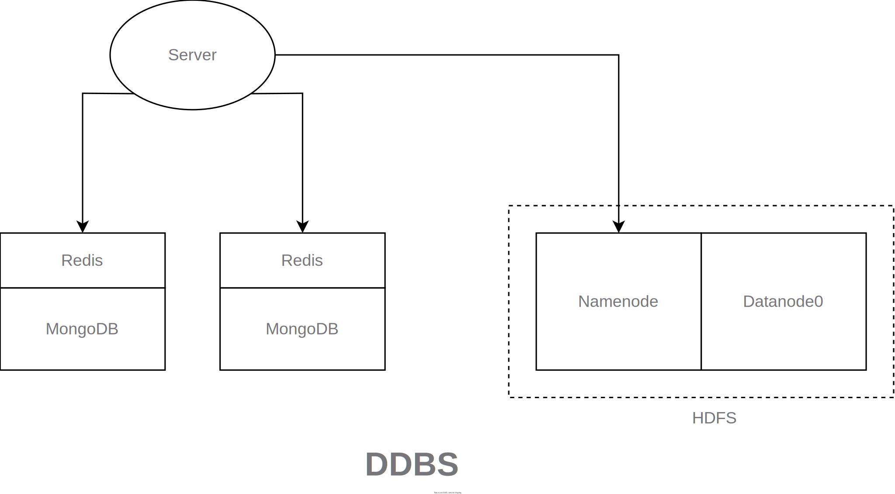

# DDBS Project

---

---

## Design Overview

- A central application server for data partition and query processing 
- MongoDB DBMS
- Redis Cache
- Hadoop HDFS

---

## Functionality

- Query/Insert/Update user data
- Get articles read by a user
- Get popular articles (daily/weekly/monthly) attached with images and videos
- Monitor server status

---

## Implementation

- Build the DDBS on a host with ports exposed using Docker  
- Implement the server in Python (700~ SLOC)

---

## DEMO